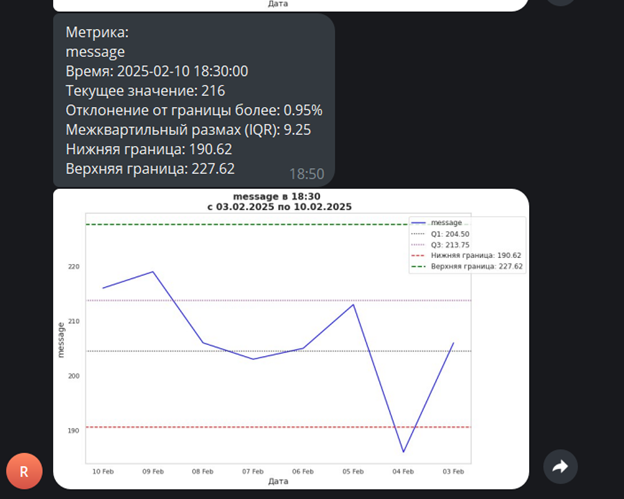

# alert_bot
## 📊 Telegram Alert Bot with Airflow

В проекте реализован Telegram-бот, который каждые 15 минут:

- извлекает ключевые метрики из ClickHouse;
- анализирует данные на аномалии при помощи межквартильного размаха (IQR);
- отправляет сообщение и график метрики в Telegram, если обнаружено отклонение.

### ⚙️ Технологии

- Python (pandas, seaborn, matplotlib)
- Airflow (DAG, task decorators)
- ClickHouse + SQL
- Telegram Bot API

### 🧠 Метрики мониторинга

- Количество просмотров (`views`)
- Количество лайков (`likes`)
- CTR (`likes / views`)
- Уникальные пользователи ленты и мессенджера
- Количество сообщений

### 🔄 Архитектура
````markdown
Airflow DAG (каждые 15 минут)
     |
     v
ClickHouse (SQL запрос)
     |
     v
Обработка данных → Анализ метрик
     |
     v
Telegram Bot (сообщения + графики)
````


### 🧪 Пример уведомления в Telegram



### 🚀 Установка

1. Клонируй репозиторий:
<br/>`git clone https://github.com/anderson-ru/alert_bot.git`

2. Установи зависимости:
<br/>`pip install -r requirements.txt`

3. Создай файл .env:
<br/>`TELEGRAM_TOKEN=ваш_токен`
<br/>`CHAT_ID=ваш_chat_id`

4. Запусти DAG в Airflow

### 📦 requirements.txt
````markdown
pandas
numpy
matplotlib
seaborn
python-telegram-bot==13.15
apache-airflow
pandahouse
````
### 📁 Структура проекта
````markdown
├── bot_alert_1.py         # DAG и логика бота
├── .env                   # Секреты Telegram
├── README.md              # Документация проекта
├── requirements.txt       # Зависимости
````

